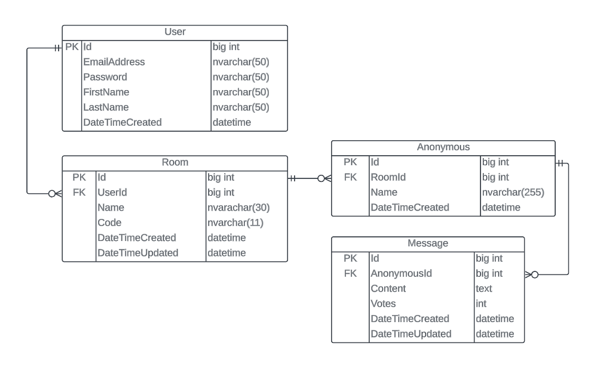

# Discussify (Discussify API)

## This API operates on five types of entities:

* **User**: This represents a discussify user. This is used to identify the creator of the room.
* **Anonymous**: This represents a discussify anonymous user in a room. This is used to identify the creator of the message in a room.
* **Room**: This represents a room created by a teacher. Each room can be joined by an anonymous user with a specific room code.
* **Message**: This represents a message in a room. Each message is always sent by an anonymous user.

---
### Prepared by:
Group 5 - F1

**Xavier David Maranga** \
**Sly Kint Bacalso** \
**Raymart Leyson** \
**Raul Jay Yanson** \
**Chlarence Callelero** 
